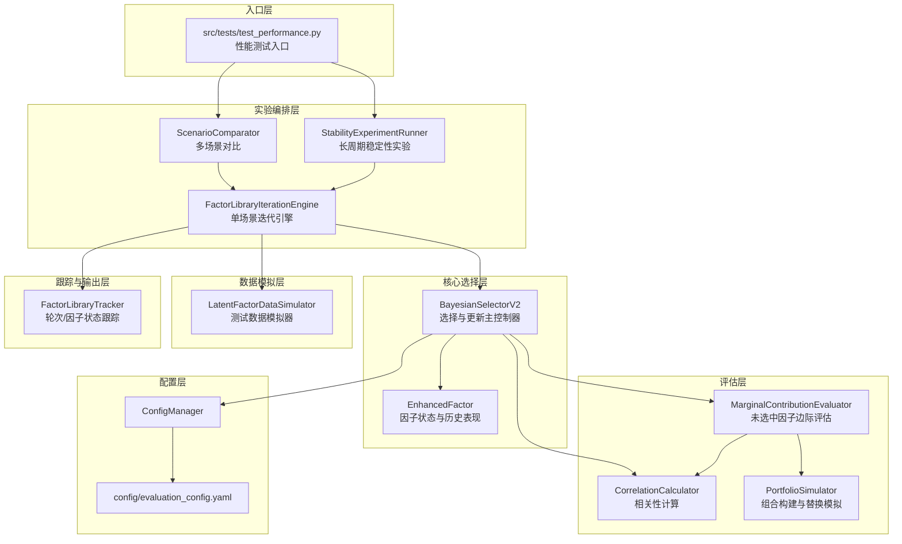

# 代码架构速查文档（Iteration3 当前实现）

> 更新时间: 2026-03-07
> 目的: 快速理解当前代码模块关系、核心流程与跟踪输出

## 1. 模块关系图



## 2. 核心模块

说明:
- `src/core/__archive/` 与 `src/simulation/__archive/` 存放历史MVP链路模块，不参与当前主流程。

### 2.1 `src/core/bayesian_selector_v2.py`
- `select_factors(current_date, target_size)`
- `update_from_performance(selected_ids, performance_data, current_date)`
- `verbose` 开关（可关闭过程明细日志，仅保留外层关键统计）
- `SelectionResult`: 记录当轮选中与候选得分
- `UpdateResult`: 记录选中/未选中更新结果、统计、`marginal_details`

关键逻辑:
- 选择: `final_score = 0.7 * aggregate_score + 0.3 * Beta(alpha,beta)采样`
- 更新:
- 选中因子按 selected success 规则更新 alpha/beta
- 未选中因子走边际贡献评估（SUCCESS/FAILURE/NEUTRAL/UNCERTAIN）

### 2.2 `src/core/factor_enhanced.py`
- 因子数据与历史表现容器
- 提供多窗口统计、ICIR、LS 统计、综合分
- 管理贝叶斯参数 `alpha/beta`

### 2.3 `src/evaluation/marginal_contrib.py`
- 对未选中因子执行边际贡献评估
- 组合模拟 + 相关性 + 候选质量综合打分
- 输出 `MarginalContributionResult`

### 2.4 `src/evaluation/portfolio_simulator.py`
- 组合构建与替换评估
- 支持 `equal_weight/icir_weighted/sharpe_optimized/...`
- 输出边际改善 `marginal_improvement` 与替换可行性

### 2.5 `src/core/correlation_calculator.py`
- 因子收益序列相关性矩阵
- 相关性显著性与汇总指标

### 2.6 `src/evaluation/library_tracker.py`
- 每轮跟踪:
- 选中结构: good/medium/bad
- 选中成功结构: good/medium/bad
- 每因子逐轮状态: 是否选中、是否成功、边际评估、打分、更新前后 alpha/beta
- 因子库整体指标: all vs selected 的 ICIR/LS 分布
- 导出文件:
- `round_summary.csv`
- `factor_round_status.csv`
- `library_metrics.json`
- `final_library.json`（最终固化因子库版本，由测试入口生成）

### 2.12 `src/evaluation/library_dynamics_plotter.py`
- 根据每轮验证指标生成 `validation_dynamics.svg`
- 标注稳定性通过轮次与最终出库轮次
- 可选生成 `test_dynamics.svg`（含 test ICIR/Sharpe/rtn）

### 2.7 `src/simulation/latent_factor_data_simulator.py`（模拟数据逻辑）
- 统一封装测试数据生成逻辑（日期、股票收益、滚动收益、因子历史表现）
- 标签收益口径: `R(t+1->t+n)`（不含t当日）
- 多空收益口径: 因子加权多空（多头权重和=1，空头权重和=1）
- 因子仍保留长期分类标签，并引入潜在状态按期切换
- 可选按 `train/validation/test` 使用不同状态转移矩阵（`PHASE_TRANSITION_PROBS`）
- 对测试入口提供稳定接口：
- `build_market_data()`
- `generate_factors()`
- 后续接入真实数据时，可在 simulation/data-source 层替换，不改测试评估主流程

### 2.8 `src/workflows/factor_library_iteration_engine.py`（流程编排）
- 封装单场景完整流程：
- 数据准备 -> 选择更新 -> OOS评估 -> 稳定性评估 -> 早停判定 -> 最终库固化
- 支持两种评估模式：
- `strict_holdout`（train迭代 + 固定validation评估）
- `walk_forward_test`（滚动到test末尾）
- `strict_holdout` 最终选库为“稳定性通过轮次中的Validation最优轮次”，并保留最后一轮对照
- 输出 `final_library.json`，作为后续融合阶段输入候选

### 2.9 `src/experiments/factor_library_scenario_experiment.py`（实验管理）
- 封装多场景构造与批量运行
- 输出场景对比汇总（good选中率、召回率、更新成功率等）

### 2.11 `src/experiments/phase_regime_comparison_experiment.py`
- 分阶段状态转移（train/validation/test）对照实验
- 用于验证“验证/测试阶段环境变化”对最终出库质量的影响

### 2.10 `src/experiments/factor_library_stability_experiment.py`（稳定性实验）
- 面向“长历史 + 多轮次”实验，观察因子库收敛行为
- 复用 `FactorLibraryIterationEngine` 跑单场景
- 追加稳定性产物导出：
- `stability_convergence.svg`（稳定性/换手率/OOS/收敛指标曲线）
- `stability_report_*.json`（同口径时序数据）

## 3. 主流程（`test_performance.py` / `experiment_stability_early_stop.py`）

```text
生成模拟数据
  -> experiments层构造场景
  -> workflows层驱动单场景迭代
  -> simulation层提供市场数据与因子历史表现
  -> 按 train/validation/test 比例切分时间轴
  -> 先基于上一轮库在新观测区间的表现执行 posterior 更新
  -> selector.select_factors() 选出当轮库
  -> 构造用于更新的 performance_data（信号-标签配对: x(t) -> R(t+1->t+n)）
  -> tracker.record_round()
循环多轮后:
  -> 在固定validation区间计算OOS与稳定性指标(overlap/turnover)
  -> 检查早停条件（收敛则提前结束）
  -> tracker.export()
  -> 导出 round_compact_summary.csv（每轮紧凑指标）
  -> 导出 final_library.json
  -> （稳定性实验）导出 stability_convergence.svg + stability_report.json
  -> 打印总体指标与输出路径
```

`src/tests/test_performance.py` 参数:
- `--baseline-only`：仅运行 baseline，不做多场景对比
- `--seed`：设置随机种子
- `--num-stocks/--num-factors/--target-size/--num-days`：覆盖核心规模参数
- `--horizon-days`：覆盖共享前瞻窗口（IC/LS共用）
- `--annual-days`：覆盖年化天数

`src/tests/experiment_phase_regime_comparison.py` 参数:
- `--baseline-only`
- `--num-stocks/--num-factors/--target-size/--num-days`
- `--horizon-days`
- `--annual-days`

## 4. 关键配置映射

配置文件: `config/evaluation_config.yaml`

- `time_windows.selection`: 选择阶段多窗口（默认 5/20/60）
- `time_windows.evaluation.selected_short`: 选中因子 success 回看窗口（默认 10）
- `success_thresholds.selected`: 选中因子 success 阈值
- `success_thresholds.unselected`: 未选中因子边际评估阈值
- `bayesian.update_rules`: alpha/beta 更新权重
- `marginal_contribution`: 组合方法、替换策略、最小改善阈值

## 5. 架构变更同步要求

若出现以下任一变更，必须同步更新文档:
- 模块职责/调用链变更
- 选择逻辑或更新逻辑变更
- 成功判定阈值或参数变更
- 输出文件结构或字段变更

必须同步更新:
- `docs/CODE_ARCHITECTURE.md`
- `docs/EVALUATION_STANDARDS.md`
- `docs/ITERATION3_SUMMARY.md`

补充协议文档:
- `docs/FACTOR_LIBRARY_EVAL_PROTOCOL.md`
