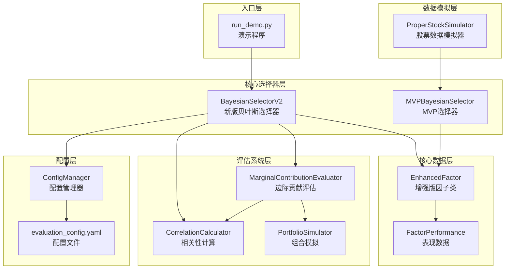

# 代码架构速查文档

> 生成时间: 2026-03-01
> 目的: 帮助快速理解代码模块关系和核心函数

---

## 1. 模块关系图 (Mermaid)



---

## 2. 核心模块功能说明

### 2.1 BayesianSelectorV2 (主选择器)
**文件**: `src/core/bayesian_selector_v2.py`

| 方法 | 功能 | 关键参数 |
|------|------|----------|
| `__init__` | 初始化选择器，加载配置 | config_path |
| `add_factor()` | 添加单个因子 | EnhancedFactor对象 |
| `add_factors()` | 批量添加因子 | List[EnhancedFactor] |
| `select_factors()` | **核心**: 选择因子 | current_date, target_size |
| `update_from_performance()` | **核心**: 更新贝叶斯参数 | selected_ids, performance_data, current_date |
| `_calculate_factor_scores()` | 计算因子综合得分 | current_date |
| `_thompson_sampling_selection()` | Thompson Sampling选择 | candidate_scores, target_size |
| `save_state()` / `load_state()` | 状态持久化 | filepath |

**核心流程**:
```
select_factors() 
  → _calculate_factor_scores() [多窗口多指标打分]
  → _thompson_sampling_selection() [贝叶斯采样]
  → 返回选中因子列表

update_from_performance()
  → 评估选中因子是否成功
  → 边际贡献评估没选中因子
  → 更新贝叶斯参数 (alpha, beta)
```

---

### 2.2 EnhancedFactor (因子数据)
**文件**: `src/core/factor_enhanced.py`

| 方法 | 功能 | 返回值 |
|------|------|--------|
| `add_daily_performance()` | 添加日度表现 | None |
| `get_recent_performance()` | 获取最近N天表现 | List[FactorPerformance] |
| `calculate_icir()` | 计算ICIR (IC均值/标准差) | float |
| `calculate_ls_return_stats()` | 计算多空收益统计 | Dict |
| `get_aggregate_score()` | 获取综合得分 | float |
| `update_bayesian_params()` | 更新贝叶斯参数 | None |
| `get_success_rate()` | 获取历史成功率 | float |

**关键属性**:
- `id`: 因子ID
- `alpha`: 贝叶斯成功次数 (先验)
- `beta`: 贝叶斯失败次数 (先验)
- `performance_history`: List[FactorPerformance]

---

### 2.3 CorrelationCalculator (相关性)
**文件**: `src/core/correlation_calculator.py`

| 方法 | 功能 |
|------|------|
| `calculate_correlation()` | 计算两个因子相关性 |
| `calculate_correlation_matrix()` | 计算相关性矩阵 |
| `calculate_significance()` | 计算显著性 |

---

### 2.4 PortfolioSimulator (组合模拟)
**文件**: `src/evaluation/portfolio_simulator.py`

| 方法 | 功能 |
|------|------|
| `simulate_portfolio()` | 模拟组合表现 |
| `evaluate_replacement()` | 评估因子替换效果 |
| `find_best_replacement()` | 寻找最佳替换因子 |

---

### 2.5 MarginalContributionEvaluator (边际贡献)
**文件**: `src/evaluation/marginal_contrib.py`

| 方法 | 功能 |
|------|------|
| `evaluate_factor()` | 评估单个因子边际贡献 |
| `evaluate_multiple_factors()` | 批量评估 |
| `_calculate_marginal_score()` | 计算边际得分 |

---

### 2.6 ProperStockSimulator (数据模拟)
**文件**: `src/simulation/stock_simulator.py`

| 方法 | 功能 |
|------|------|
| `generate_correlated_series()` | 生成与目标收益相关的因子得分 |
| `calculate_weighted_long_short_return()` | 计算得分加权多空收益 |

**关键数学**:
```
因子得分 = ρ × 收益 + √(1-ρ²) × 噪声
其中 ρ = 目标IC
```

---

### 2.7 ConfigManager (配置)
**文件**: `src/utils/config_manager.py`

| 方法 | 功能 |
|------|------|
| `load_config()` | 加载YAML配置 |
| `get_window_weights()` | 获取时间窗口权重 |
| `get_indicator_weights()` | 获取指标权重 |

---

## 3. 数据流总览

```
原始数据
    ↓
EnhancedFactor (存储历史表现)
    ↓
BayesianSelectorV2.select_factors()
    ├── _calculate_factor_scores()
    │   └── EnhancedFactor.get_aggregate_score()
    │       └── 多窗口 (5/20/60天) × 多指标 (ICIR/收益/排名/稳定性)
    │
    └── _thompson_sampling_selection()
        └── Beta采样: score × 0.7 + β(alpha,beta) × 0.3
    
    ↓
选出Top-K因子
    
    ↓
update_from_performance()
    ├── 选中因子 → 判断成功 → 更新alpha/beta
    │
    └── 没选中因子 → 边际贡献评估
        ├── CorrelationCalculator (计算相关性)
        ├── PortfolioSimulator (模拟组合)
        └── MarginalContributionEvaluator (决策)
```

---

## 4. 快速阅读路径

### 路径1: 理解主流程 (推荐)
1. `run_demo.py` → 入口
2. `bayesian_selector_v2.py` → 核心选择逻辑
3. `factor_enhanced.py` → 数据结构

### 路径2: 理解评估系统
1. `bayesian_selector_v2.py` → 如何调用评估
2. `marginal_contrib.py` → 边际贡献逻辑
3. `correlation_calculator.py` → 相关性计算
4. `portfolio_simulator.py` → 组合模拟

### 路径3: 理解数据模拟
1. `stock_simulator.py` → 核心模拟逻辑
2. 关注 `calculate_weighted_long_short_return()` 方法

---

## 5. 关键配置项

**文件**: `config/evaluation_config.yaml`

```yaml
time_windows:
  selection:      # 选择时用的时间窗口
    short_term: 5
    medium_term: 20
    long_term: 60
  evaluation:     # 评估时用的时间窗口
    selected_short: 10
    selected_long: 20
    
indicators:
  weights:        # 指标权重
    icir: 0.4
    ls_return: 0.3
    rank: 0.2
    stability: 0.1

success_thresholds:
  selected:      # 选中因子的成功标准
    icir: 0.8
    ls_return_annual: 0.05
    rank_percentile: 0.7
    win_rate: 0.55
  unselected:     # 没选中因子的成功标准 (更严格!)
    icir: 1.5
    ls_return_annual: 0.10
```

---

## 6. 常见问题

### Q: 如何添加新因子?
```python
from src.core.factor_enhanced import EnhancedFactor

factor = EnhancedFactor(
    factor_id="F001",
    expression="Div($high, $close)",
    topic="momentum"
)

# 添加历史表现
factor.add_daily_performance(
    date="2024-01-01",
    ic=0.05,
    ls_return=0.001,
    rank_percentile=0.3
)

selector.add_factor(factor)
```

### Q: 如何调整选择数量?
```python
# 方法1: 在select_factors中指定
result = selector.select_factors("2024-01-31", target_size=10)

# 方法2: 修改配置文件
# config/evaluation_config.yaml 中的 target_size
```

### Q: 如何修改评估标准?
```yaml
# config/evaluation_config.yaml
success_thresholds:
  selected:
    icir: 1.0  # 调高ICIR要求
```

---

## 7. 快速阅读路径 (推荐顺序)

### 路径1: 理解主流程 (推荐新手)
1. `run_demo.py` → 入口，了解整体运行方式
2. `bayesian_selector_v2.py` → 核心选择逻辑，理解因子如何被选择和更新
3. `factor_enhanced.py` → 数据结构，理解因子如何存储历史表现

### 路径2: 理解评估系统
1. `bayesian_selector_v2.py` → 看如何调用评估
2. `marginal_contrib.py` → 边际贡献逻辑，理解为何选择/不选择某个因子
3. `correlation_calculator.py` → 相关性计算
4. `portfolio_simulator.py` → 组合模拟

### 路径3: 理解数据模拟
1. `stock_simulator.py` → 核心模拟逻辑
2. 重点关注 `calculate_weighted_long_short_return()` 方法

---

*文档自动生成，如有疑问请查看源代码注释*
